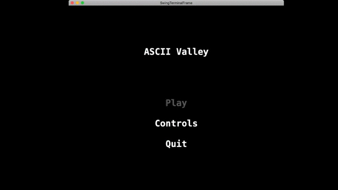

# ASCIIValley

- **Project name:** ASCIIValley
- **Short description:** Clone of the indie RPG game *Stardew Valley* in a console environment.
- **Tools:** Java, Lanterna
- **Institution:** [FEUP](https://sigarra.up.pt/feup/en/web_page.Inicial)
- **Course:** [LPOO](https://sigarra.up.pt/feup/en/UCURR_GERAL.FICHA_UC_VIEW?pv_ocorrencia_id=420000) (Object Oriented Programming Laboratory)
- **Project grade:** 19.3/20.0
- **Group members:**
    - [João António Cardoso Vieira e Basto de Sousa](https://github.com/JoaoASousa) ([up201806613@fe.up.pt](mailto:up201806613@fe.up.pt))
    - [Rafael Soares Ribeiro](https://github.com/up201806330) ([up201806330@fe.up.pt](mailto:up201806330@fe.up.pt))

**ASCII Valley** is a simplified text-based adaptation of the indie simulation role-playing video game Stardew Valley with some influences of
 Dwarf Fortress when it comes to the visual details.
 
The player takes on the role of a character who takes charge of his deceased grandfather abandoned farm located in a site named Stardew Valley.
Planting and harvesting crops and fighting off mummies are some of the things that will make you play ASCII Valley for hours on end!

## Gameplay

 
