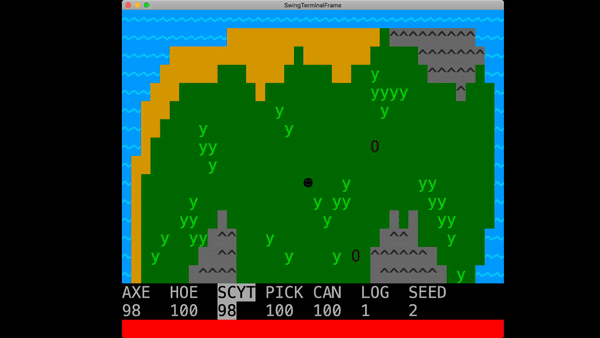
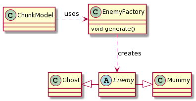

# LPOO_T6G4 - ASCII Valley

**ASCII Valley** is a simplified text-based adaptation of the indie simulation role-playing video game Stardew Valley with some influences of
 Dwarf Fortress when it comes to the visual details;
the player takes on the role of a character who takes charge of his deceased grandfather's abandoned farm located in a site named Stardew Valley.
Planting and harvesting crops and fighting off mummies are some of the things that will make you play ASCII Valley for hours on end!

This project was developed by Joao Sousa (up201806613@fe.up.pt) 

and Rafael Ribeiro (up201806330@fe.up.pt)
 
for LPOO 2019⁄20
 
 
## Implemented Features

### Map Saving
Storing of map state in a save file. The map is divided in chunks and each chunk's data is divided in 4 parts: an ID, the IDs of it's neighbor 
chunks, a matrix that references the ground "type" and another that references the entity on said tile, if it exists. 
The interpretation of these values is intentionally hardcoded, since these save files are only edited and accessed by the game.

### Map visualization
Displaying of the chunk where the player is located, terrain and map entities included.


### Movement
As of now, the player can move around the current map chunk, colliding with the map entities that are supposed to be solid.
### Movement between chunks. 
When the player goes beyond an "edge" of a chunk it moves to the respective neighbour chunk.


### Enemies and their behaviour.
The enemy entities (Mummies) have different behaviour depending on how close they are to the player,
determining their next action based on it.


### Combat 
Melee combat based on the hero project of the practical classes is the way for the player to combat the enemies.

### Main menu
The starting point of the game is a menu that presents the player with options to load the game, see the game controls and quit.


### GUI 
In the form of a player toolbar that holds the players' tools, that allow the player to interact with specific parts of the game,
and also the items collected through said interactions.




## Desired Features
This section lists functionalities that were thought up in the start of the project and were
not be achieved in the time frame we had.

- #### Day-night Cycle, that visually alters the map.

- #### Simple NPC system with item delivery missions.


## Design

### 1. MVC

#### **Problem in Context**
At the start of the project, even before writing any lines of code, while drafting a general idea of the project it became clear that
file organization would have to be one of the foundations in order to find quickly what we are looking for and, in general, to have a good
development process.

#### **The Pattern**

Therefore we chose to use the architectural pattern known as **MVC**: Model-View-Controller. It divides the application in three parts, 
allowing for separation in groups of functions according to their role and by extension allowing also better function separation/organization.


#### **Implementation**
We started off by creating a GameController class in charge of holding a MapView and EntityView classes. 
From here it will be easy to implement new features on the Player and Entity end, but also to easily grow the input actions.   


[//]: # (This uml represents the current primitve setup, it will be altered along the line, especially on the subject of
entities besides the player.)

#### **Consequences**

**Benefits:**
- ease of working simultaneously in the same project without interfering with each other's work.
- allows for a higher degree of cohesion. Methods that perform actions of the same "domain" are grouped together. For example, the
 files [ChunkView.java](../src/main/java/com.g64.view/ChunkView.java), [MapView.java](../src/main/java/com.g64.view/MapView.java) and [EntityView.java
 ](../src/main/java/com.g64.view/EntityView.java) that deal which tasks are related to data displaying all belong to the package `com.g64.view`.
- possibly faster development speed in the long run due to the consistent organization.

**Liabilities:**
- requires a higher number of files that can build up over time with the increase of the project's complexity.


### 2. Command
#### **Problem in Context**
After initially writing in the reading of keyboard inputs, it was clear the "switch" approach was messy and 
did not scale properly. Also the need for enemies with behaviour similar to the players' made this pattern fit very well.
Later on, a game state related situation came up, more precisely related with the ``menuGameState``.
The menu had three possible options: "Play", "Controls" and "Quit" and by selecting a certain option the player would get different outcomes and 
implementing every outcome within the ``menuGameState`` didn't look like the best option.

#### **The Pattern**
The **Command** pattern consists of parameterizing clients with different requests, in our case, the player, enemy and menu actions.  

#### **Implementation**
This was done in the form of an **Action** interface and several commands that are executed when appropriate. 
Namely, the [Move](../src/main/java/com/g64/controller/action/MoveDown.java) family of actions, responsible for movement and collision checking of the "invoker" entity.


In the [MenuGameState](../src/main/java/com/g64/model/gameState/MenuGameState.java) class, this pattern is present within the list of ``menuOptions``.
Each ``menuOption`` has a String associated with it as well as a ``MenuCommand`` implementation, which is the element that effectively knows how to execute the ``menuOption``'s action.

#### **Consequences**
The code in the com.g64.controller is much easier to read and also proved to make the scaling of the inputs easier, 
especially alongside the **State** pattern next described.


### 3. State
#### **Problem in Context**
Having started by implementing the game itself, we came across difficulties when trying to incorporate other parts of the game, highlighting the menu that appears at the start.
The different game "states" and the transitions (finite-state machine) between them were mostly dealt with by using a switch statement in the start function of the game controller.

```java
enum gameStates {
    MAIN_MENU, CONTROLS, IN_GAME;
}

public void start() {
    while (running){
        switch (gameState) {
            case MAIN_MENU:
                // (...)
                break;

            case CONTROLS:
                // (...)
                break;

            case IN_GAME:
                // (...)    
                break;
        }
    }
}
```

This first solution was obviously not optimal: the function was becoming unnecessarily long and in case of a new possible game state the enum gameStates 
and the function start would need to be changed (adding another case to the switch statement), for example.

Another part of our code that soon started to become problematic was the behaviour of the enemies, which heavily depended on the distance the enemy was to the player.

#### **The Pattern**
The pattern **State** was chosen for both cases. It lets an object change its behavior depending on its internal state and is a way of 
implementing a finite-state machine making it highly appropriate for the situation.

#### **Implementation**
The game controller keeps track of the current state of the game which can be changed according to the player input.
Each possible ``GameState`` implements an ``execute`` (which calls the necessary draw functions) and ``processKey`` 
functions (which processes the player's key presses), allowing different funcionalities for a same key press depending on the context
and transitions between states.


The enemies hold the active "humour", which can be either an [AggroedHumour](../src/main/java/com/g64/model/entities/enemy/humours/AggroedHumour.java) or a [NormalHumour](../src/main/java/com/g64/model/entities/enemy/humours/NormalHumour.java), 
and change between these two according to the distance to the player, which is checked on every game cycle by the function `updateState()` [here](../src/main/java/com/g64/model/entities/enemy/Enemy.java). 
 
 


#### **Consequences**
This pattern helped reducing the clutter and size of ``start`` function of [GameController](../src/main/java/com/g64/controller/GameController.java) (it is now about 5 times smaller than previously) 
and made it possible to easily add afterwards a [DeadPlayerState](../src/main/java/com/g64/model/gameState/DeadPlayerState.java) 
(for when the player dies), improving consequentially the maintainability and readability of the code.
It also simplified the creation of new and varied enemies, as was the case of the [Ghost](../src/main/java/com/g64/model/entities/enemy/Ghost.java), implemented much later than the [Mummy](../src/main/java/com/g64/model/entities/enemy/Mummy.java). 

### 4. Factory
#### **Problem in Context**
Near the start of the project, while implementing the way the game translated the save file into the corresponding objects, it became clear that the lazy approach
of just a switch was messy. Later, with the addition of enemies and the need for these to be created on demand by the specifi chunks,
this method also fit well.

#### **The Pattern**
The **Factory** pattern, capable of creating objects of unspecified classes, saved us the use of messy constructors and unmaintainable switch cases.

#### **Implementation**
On the case of the [MapTerrain](../src/main/java/com/g64/model/terrain/MapTerrain.java) objects, that hold the information of each ground type, the implementation of the [MapTerrainFactory](../src/main/java/com/g64/model/terrain/MapTerrainFactory.java) was straightforward,
since the translation of save file to object is hard coded.


Similarly, the [EnemyFactory](../src/main/java/com/g64/model/entities/enemy/EnemyFactory.java) simply constructs an enemy at a random position of the map, being called 
by the ChunkModel whenever there is a need to add an enemy to a chunk. 



#### **Consequences**
This pattern helped by decoupling the creation of these entities from the classes that hold them, improving readability as well. 
We didn't implement other types of enemies besides [Mummies](../src/main/java/com/g64/model/entities/enemy/Mummy.java) and [Ghosts](../src/main/java/com/g64/model/entities/enemy/Ghost.java)
but this could easily be expanded on with this pattern.

### 5. Visitor
#### **Problem in Context**
When implementing the usage of different tools and items by the player, we soon realized that these
varied a lot depending on the parts of the map they interacted with ([Axe](../src/main/java/com/g64/model/items/tools/Axe.java) 
interacts with both [Enemies](../src/main/java/com/g64/model/entities/enemy/Enemy.java) and [MapEntities](../src/main/java/com/g64/model/entities/map/MapEntity.java) ; 
[Hoe](../src/main/java/com/g64/model/items/tools/Hoe.java) interacts with [MapTerrain](../src/main/java/com/g64/model/terrain/MapTerrain.java)).
In an initial phase, this led to the use of **instanceof** operations to quickly determine if the action would be accepted on said "Target", something that clearly goes against polymorphism. 

```java
public class Axe extends Item {

    @Override
    public void use(GameController controller, Position position){
        MapEntity target = controller.getMapModel().thisChunk().getEntityAt(position);
        if(target instanceof TreeEntity) target.remove();
    }
}
```

#### **The Pattern**
Thus the use of the visitor pattern was a solution we found, since it consists of separating the actions done by the items from their classes, following the open/closed principle.

#### **Implementation**
By creating a class [ItemVisitor](../src/main/java/com/g64/model/entities/visitors/ItemVisitor.java) with functions 
[allowUsage(Item item)](../src/main/java/com/g64/model/entities/visitors/ItemVisitor.java) overridden to accept all possible "interactable" items.
Alongside these, all items also implement an [accept(ItemVisitor itemVisitor)](../src/main/java/com/g64/model/items/tools/Hoe.java) method, which consists of calling the visitor's method corresponding to itself.
The process of getting the map objects from the position that was interacted with, deciding which objects to evaluate and effectively cause changes to these are all handled by the visitor. 


#### **Consequences**
This makes the code on the the [Interact](../src/main/java/com/g64/controller/action/InteractDown.java) actions more readable, since the handling of the item is done entirely by this new class.
However, this also has its' downsides: the creation of new items is less intuitive, and in a game like ours would, in the long run, be hindering.
Despite helping us remove a lot of the smelly **instanceof** calls, we were not able to completely rid this part of our code from them.  


[//]: # (This section should be organized in different subsections, each describing a different design problem that you had to solve during the
project. Each subsection should be organized in four different parts:
Problem in Context: The description of the design context and the concrete problem that motivated the instantiation of the pattern. Someone else other than the original developer should be able to read and understand all the motivations for the decisions made. When
refering to the implementation before the pattern was applied, don’t forget to link to the relevant lines of code in the appropriate version.
The Pattern: Identify the design pattern to be applied, why it was selected and how it is a good fit considering the existing
design context and the problem at hand.
Implementation: Show how the pattern roles, operations and associations were mapped to the concrete design classes. Illustrate it
with a UML class diagram, and refer to the corresponding source code with links to the relevant lines, these should be relative links. When doing this, always point to the latest version of the code.
Consequences: Benefits and liabilities of the design after the pattern instantiation, eventually comparing these consequences with
 those of alternative solutions.)


## Known Code Smells And Refactoring Suggestions

### 1. Bloater - Long Method
#### **Problem in Context**
Evidently, the function that sticks out the most as being too long is the readMap method,
in charge of porting the map information from the .csv file to the Map object.

#### **Solution**
Even after multiple uses of the **Extract Method**, it can still be considered too long,
mostly because of the mess of code in charge of opening and reading the file itself.

### 2. Object-Orientation Abuser - Switch Statement
#### **Problem in Context**
There are various places in our project where switch statements are still present. Namely, in the [MapEntityFactory](../src/main/java/com/g64/model/entities/map/MapEntityFactory.java) and
[MapTerrainFactory](../src/main/java/com/g64/model/terrain/MapTerrainFactory.java), in charge of creating [MapEntity](../src/main/java/com/g64/model/entities/map/MapEntity.java) and [MapTerrain](../src/main/java/com/g64/model/terrain/MapTerrain.java) 
objects from the characters saved in the [save file](../resources/chunks.csv) 
```java
public static MapEntity get(Position position, String string){
        switch (string){
            case "^":
                return new RockEntity(position);
            case "~":
                return new WaterEntity(position);
            case "y":
                return new TallGrassEntity(position);
            case "O":
                return new TreeEntity(position);
            case "#":
                return new UnpassableWallEntity(position);
            case "i":
                return new GrownCornEntity(position);
            case "j":
                return new GrownCarrotEntity(position);
            default:
                return null;
        }
    }
```

Other places where the switch smell is present are in the `handleBoundaryCrossing()` functions on movable entities ([Player](../src/main/java/com/g64/model/entities/Player.java) and [Enemies](../src/main/java/com/g64/model/entities/enemy/Enemy.java))
which move the player between chunks and keep the enemies from leaving their current chunk.
```java
    @Override
    public void handleBoundaryCrossing(MapModel map){
        MapModel.Crossing crossing = map.checkBoundaries(position);
        switch (crossing) {
            case NO_CROSS:
                (...)
            case CROSS_DOWN:
                (...)
            case CROSS_UP:
                (...)
            case CROSS_LEFT:
                (...)
            case CROSS_RIGHT:
                (...)
        }
    }
```

#### **Solution**
When it comes to the presence of the switch on the **Factory** classes, since the cases are simple and easy to update with the creation of new
**Map** objects, we think the smell can be ignored.
On the other hand, the switch in the `handleBoundaryCrossing()` functions could be extracted with the **Replace type code with subclasses**
method by making the `Crossing` enum an abstract class with subclasses `CrossRight`, `CrossUp`, ... with an overridden method `handle()`. 

### 3. Dispensable - Duplicate Code
#### **Problem in Context**
The [MainMenuView](../src/main/java/com/g64/view/MainMenuView.java) and [PauseMenuView](../src/main/java/com/g64/view/PauseMenuView.java) classes act very similarly and thus 
their `draw()` methods have a lot of duplicate code.

#### **Solution**
By using the **Extract superclass** method the duplicate code can be stored in a
superclass `MenuView` with a single `draw()` method that maintains functionality.

### 4. OOP Abuser - instanceof
#### **Problem in Context**
Despite using the **Visitor** pattern in [ItemVisitor](../src/main/java/com/g64/model/entities/visitors/ItemVisitor.java) to remove most of the **instanceof** checks in our code,
this only saved us from the checking the type of the `Tool` or `Drop` in question. There is still the need to check for the type of the targeted part of the map
(`MapEntity` and `MapTerrain`) and act accordingly.
```java
    @Override
    public Item.usageValue allowUsage(Axe item) {
        if (entity instanceof TreeEntity || entity instanceof Enemy){
           (..)
        }
    }
```  

#### **Solution** 
To solve this smelly code, the **Visitor** pattern would be the best choice. An implementation of a `MapTerrainVisitor` and `MapEntityVisitor`, with overrides for every item would
work.
```java
    @Override
    public Item.usageValue allowUsage(Axe item) {
        if (entity instanceof TreeEntity || entity instanceof Enemy){
           (..)
        }
    }
``` 

## Testing


## SELF-EVALUATION

50% Rafael Ribeiro
50% Joao Sousa

