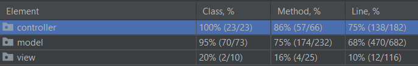

# LPOO_T6G4 - ASCII Valley

**ASCII Valley** is a simplified text-based adaptation of the indie simulation role-playing video game Stardew Valley with some influences of
 Dwarf Fortress when it comes to the visual details;
the player takes on the role of a character who takes charge of his deceased grandfather's abandoned farm located in a site named Stardew Valley.
Planting and harvesting crops and fighting off mummies are some of the things that will make you play ASCII Valley for hours on end!

This project was developed by Joao Sousa (up201806613@fe.up.pt) 

and Rafael Ribeiro (up201806330@fe.up.pt)
 
 for LPOO 2019⁄20
 
 
## Implemented Features

### Map Saving
Storing of map state in a save file. The map is divided in chunks and each chunk's data is divided in 4 parts: an ID, the IDs of it's neighbor 
chunks, a matrix that references the ground "type" and another that references the entity on said tile, if it exists. 
The interpretation of these values is intentionally hardcoded, since these save files are only edited and accessed by the game.
### Map visualization
Displaying of the chunk where the player is located, terrain and map entities included - 
### Movement
As of now, the player can move around the current map chunk, colliding with the map entities that are supposed to be solid.
### Movement between chunks. 
When the player goes beyond an "edge" of a chunk it moves to the respective neighbour chunk.

## Planned Features

### Other Entities and their "behaviour".
The game needs more ways of interacting with the player and this will be achieved with enemy entities (Mummies, for example)
that present simple aggressive behaviour.

### Combat 
Melee combat based on the hero project of the practical classes will be the way for the player to combat the enemies.

### Main menu
The starting point of the game will be a menu that presents the player with options to load the game and see game controls - 

### GUI 
In the form of a player toolbar that holds the players' tools, that allow the player to interact with specific parts of the game,
and also the items collected through said interactions - 

## Desired Features
This section, unlike the last one, lists functionalities that were thought up in the start of the project but realistically will 
not be achieved in the time frame we have.

### Day-night Cycle, that visually alters the map.

### Simple NPC system with item delivery missions.

## Design

### 1. MVC

#### **Problem in Context**
At the start of the project, even before writing any lines of code, while drafting a general idea of the project it became clear that
file organization would have to be one of the foundations in order to find quickly what we are looking for and, in general, to have a good
development process.

#### **The Pattern**

Therefore we chose to use the architectural pattern known as **MVC**: Model-View-Controller. It divides the application in three parts, 
allowing for separation in groups of functions according to their role and by extension allowing also better function separation
/organization.

#### **Implementation**
We started off by creating a GameController class in charge of holding a MapView and EntityView classes. 
From here it will be easy to implement new features on the Player and Entity end, but also to easily grow the input actions.   

[//]: # (This uml represents the current primitve setup, it will be altered along the line, especially on the subject of
entities besides the player.)

#### **Consequences**

**Benefits:**
- ease of working simultaneously in the same project without interfering with each other's work.
- allows for a higher degree of cohesion. Methods that perform actions of the same "domain" are grouped together. For example, the
 files [ChunkView.java](../src/main/java/view/ChunkView.java), [MapView.java](../src/main/java/view/MapView.java) and [EntityView.java
 ](../src/main/java/view/EntityView.java) that deal which tasks are related to data displaying all belong to the package `view`.
- possibly faster development speed in the long run due to the consistent organization.

**Liabilities:**
- requires a higher number of files that can build up over time with the increase of the project's complexity.

### 2. Actions
#### **Problem in Context**
After initially writing in the reading of keyboard inputs, it was clear the "switch" approach was messy and 
did not scale properly.

#### **The Pattern**
Thus, the **Command** pattern was implemented, since it parametrizes clients with different requests, in our case, the player actions.  

#### **Implementation**
This was done in the form of an **Action** interface and several commands that are executed when appropriate. 

#### **Consequences**
The code in the controller is much easier to read and it is also now easy to scale the input interface with new key inputs and subsequent actions.

[//]: # (This section should be organized in different subsections, each describing a different design problem that you had to solve during the
project. Each subsection should be organized in four different parts:
Problem in Context: The description of the design context and the concrete problem that motivated the instantiation of the pattern. Someone else other than the original developer should be able to read and understand all the motivations for the decisions made. When
refering to the implementation before the pattern was applied, don’t forget to link to the relevant lines of code in the appropriate version.
The Pattern: Identify the design pattern to be applied, why it was selected and how it is a good fit considering the existing
design context and the problem at hand.
Implementation: Show how the pattern roles, operations and associations were mapped to the concrete design classes. Illustrate it
with a UML class diagram, and refer to the corresponding source code with links to the relevant lines, these should be relative links. When doing this, always point to the latest version of the code.
Consequences: Benefits and liabilities of the design after the pattern instantiation, eventually comparing these consequences with
 those of alternative solutions.)

## Known Code Smells And Refactoring Suggestions

### 1. Bloater - Long Method

#### **Problem in Context**
Evidently, the function that sticks out the most as being too long is the readMap method,
in charge of porting the map information from the .csv file to the Map object.

#### **Solution**
Even after multiple uses of the **Extract Method**, it can still be considered too long,
mostly because of the mess of code in charge of opening and reading the file itself.

### 2. OOP Abuser - Switch statements

#### **Problem in Context**
On the map terrain interpretation process there is a switch case that is in charge of associating each integer in the save file
with its corresponding, hardcoded color value. 
[MapTerrainModel](../src/main/java/model/MapTerrainModel.java)

#### **Solution**
This could be resolved by breaking up the rgb values into classes by using the **Replace Conditional with Polymorphism** method, which would make it more readable but also
easier to, if needed, add specific attributes to certain terrain types (though as of now we do not see this happening).

### 3. Dispensable - Data Class

#### **Problem in Context**
In the [MapEntityModel](../src/main/java/model/MapEntityModel.java) file there is an auxiliary class ``myPair`` (lines 10-18) that is only used to "group" data (data class).
Even though its existence is, in our opinion, justified by its usage in the ``MapEntityModel`` class (groups a ``TextColor`` and a ``boolean``), its implementation can be improved.

#### **Solution**
In order to increase encapsulation, the auxiliary class could be declared as `final`, all its fields as `private final` and by adding getters, or even maybe by nesting the class inside ``MapEntityModel``.  

### 4. Bloater - Data Clump

#### **Problem in Context**
Both [ChunkModel](../src/main/java/model/ChunkModel.java) and [MapModel](../src/main/java/model/MapModel.java) classes have two fields in common: ``private int width`` and ``private int height``.
This situation is unnecessary due to the fact that both fields are only used outside of the class constructor in the class ChunkModel (getter of width and height - lines 24 and 28).

#### **Solution**
Therefore, they could be removed from [MapModel](../src/main/java/model/MapModel.java) which would reduce the number of parameters of this class's constructor.
Furthermore, because the ``width``and ``height`` fields have constant values (the only values that are passed to them are ``MAP_WIDTH``and `MAP_HEIGHT` present in lines 22 and 23 of [GameController](../src/main/java/controller/GameController.java))
those "constants" could be moved to [ChunkModel](../src/main/java/model/ChunkModel.java) and passed directly to the private field, eliminating in the class as well the need to have them in the constructor.
 

### 5. Dispensable - Duplicate Code

#### **Problem in Context**
In the [ChunkModel](../src/main/java/model/ChunkModel.java) class there are in two occasions of two functions which have different parameters and do the same task: ``getTerrainColorAt(int x, int y)`` (line 36) and ``getTerrainColorAt(Position position)`` (line 40)
are essentially the same with the difference that in the first one the ``x`` and the ``y`` are passed directly while in the second one they are passed to the function inside a ``Position``
object. The same applies to ``getEntityAt(int x, int y)`` (line 44) and ``getEntityAt(Position position)`` (line 48).
This duplication of code could lead to time-consuming debugging caused for example by a small change only in one of the functions let's say "A1" (leaving "A2" unchanged) that could result in different outputs in situations apparently identical.

#### **Solution**
To fix this repetition of code one could delete the version of each function that has 2 parameters and where those specific "2-parameter" functions were called, pass as the argument ``new Position(x,y)``.

## Testing

## SELF-EVALUATION

50% Rafael Ribeiro
50% Joao Sousa

